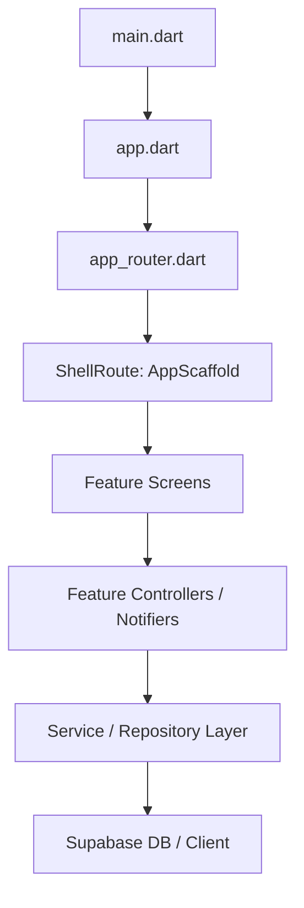

# 🏛️ Core Application Architecture

The **Promo** platform follows a **Clean Architecture** approach adapted for mobile development (known as the **Feature-First** structure). Code is split into features, which are self-contained domains, and a central core namespace that manages shared system concerns.

## Architectural Layers

### 1. Presentation Layer (UI)
- **Screens**: Located inside `/lib/features/<feature_name>/`. They listen to Riverpod state providers and display information.
- **Widgets**: Reusable visual parts. Divided into feature-specific widgets and global shared widgets (`/lib/shared/widgets/`).
- **Controllers**: Riverpod `StateNotifier` or `Notifier` classes that bind actions to service endpoints and emit new states.

### 2. Domain / Service Layer
- Located inside `/lib/core/services/` and `/lib/features/<feature_name>/services/`.
- Services act as the orchestrators of data, mapping raw inputs to API endpoints, executing validations (like magic byte scanners in `StorageService`), and caching results in Local Secure Storage.

### 3. Data Layer
- Managed via the **Supabase Flutter Client**. Database tables, migrations, security policies, and edge serverless triggers are configured in the `/supabase/` workspace root.