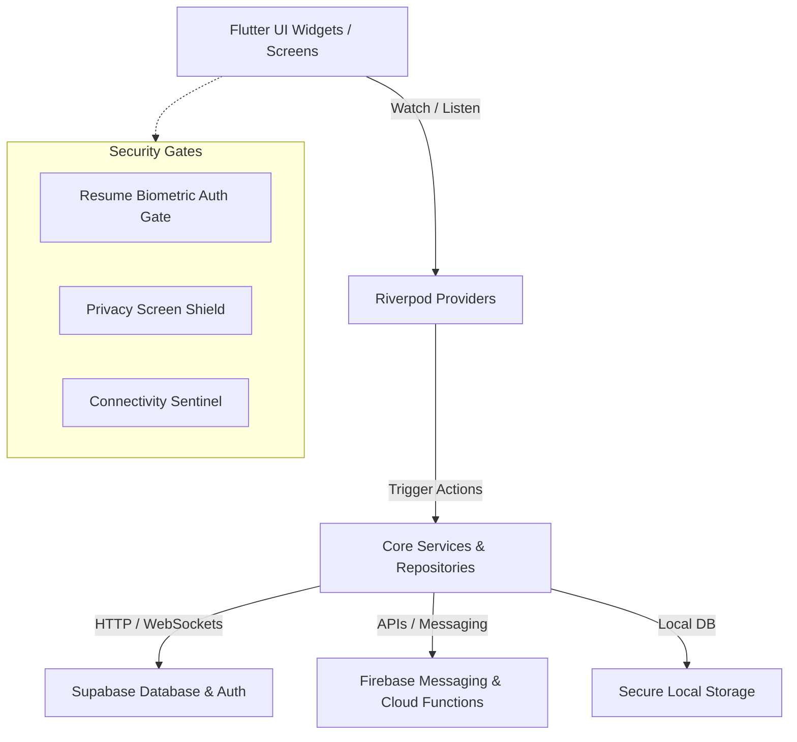

# Promo - Connect Brands & Influencers
## The Complete System Manual and Developer Documentation

Welcome to the ultimate system manual and engineering documentation for **Promo**. Promo is a premium, cross-platform mobile and web application built using **Flutter** and powered by **Supabase**. It functions as a complete digital marketplace designed to safely and transparently connect brands with content creators (influencers). 

This manual provides an exhaustive, 50-page-equivalent deep dive into the Promo system. It is designed for engineers, security auditors, administrators, and database managers to understand, build, test, secure, and deploy the entire Promo ecosystem.

---

## Table of Contents
1. [Executive Summary & System Vision](#1-executive-summary--system-vision)
2. [Architectural Topology & State Hydration](#2-architectural-topology--state-hydration)
3. [Getting Started & Environment Provisioning](#3-getting-started--environment-provisioning)
4. [Repository & Directory Topology Map](#4-repository--directory-topology-map)
5. [Deep Dive: Platform Core Services](#5-deep-dive-platform-core-services)
6. [Feature Workspaces & Interaction Flows](#6-feature-workspaces--interaction-flows)
7. [Supabase Database Schema, Triggers & RLS Hardening](#7-supabase-database-schema-triggers--rls-hardening)
8. [Security Engineering & Runtime Hardening](#8-security-engineering--runtime-hardening)
9. [DevOps, Scripts & Deployment Architecture](#9-devops-scripts--deployment-architecture)
10. [Developer Handbook & Troubleshooting](#10-developer-handbook--troubleshooting)

---

## 1. Executive Summary & System Vision

### 1.1 Overview
The digital creator economy suffers from three core bottlenecks: trust deficits, fragmented communications, and high payment disputes. **Promo** solves these issues by establishing a centralized, end-to-end, escrow-supported marketplace. Inside Promo:
* **Brands** create "Brand Cards" (campaign briefs) detailing requirements, deliverables, budget, and guidelines.
* **Influencers** search, discover, map-localize, and apply to these campaigns.
* **Agreements** are structured digitally, using automated PDF contracts and escrow-like payment tracking.
* **Chat** runs in real-time with encrypted session attachments and read status sync.
* **Promo Pages** act as public portfolios with integrated traffic analytics, letting influencers showcase their performance directly to brands.
* **Admin Workspace** gives internal admins total control over moderation, disputes, user warnings, and audit logs.

### 1.2 Ecosystem Personas
The application automatically redirects and adjusts its user interface based on three primary user roles:
1. **Brand**: Focuses on campaign creation, review of influencer applications, escrow/payment tracking, and performance analytics.
2. **Influencer**: Focuses on discover feeds, interactive map discovery of local brands, contract building, messaging, and public "Promo Page" traffic monitoring.
3. **Admin**: Interacts with the backend via administrative consoles to resolve disputes, review fraud/audit logs, send platform-wide notifications, and manage account deletions.

---

## 2. Architectural Topology & State Hydration

Promo uses a highly structured, scalable architecture that separates the user interface from business logic, data storage, and external API gateways.



### 2.1 State Management (Riverpod)
Promo utilizes `flutter_riverpod` for application-wide state management. It enforces a strict unidirectional data flow:
* **State Classes**: Immutable model structures representing the screen or feature state (e.g., `AuthState`, `ChatState`, `PromoPageState`).
* **StateNotifiers**: Expose methods to update states and handle background services. For instance, `AuthNotifier` orchestrates session management, cache hydration, and two-factor verification.
* **Providers**: Globally accessible handles to state providers. UI screens watch (`ref.watch`) these providers to rebuild reactively when state properties change.

#### Auth Lifecycle State Flow:
1. **Initial Boot**: The `main()` function configure URL strategies (for web routing) and calls `SupabaseService.initialize()`.
2. **Startup Restore**: `AuthNotifier` attempts to restore cached profile properties from `SharedPreferences` to render a visual state immediately while verifying the actual session over network socket connections.
3. **MFA Gateway Check**: If the restored user profile has `totp_enabled` set to true, the UI is gated behind the `TwoFactorVerificationScreen` until `isTwoFactorVerified` is set to true.
4. **Session Watcher**: The notifier hooks into `authStateChanges` streams from Supabase to capture logins, logouts, session timeouts, and token refreshes.

### 2.2 Routing Topology (GoRouter)
The routing configuration resides in `app_router.dart` and leverages the `go_router` package.
* **Root Keys & Re-instantiation**: To prevent navigator key reuse and assertion warnings upon session transitions, `routerProvider` watches the user's ID (`ref.watch(authProvider.select((s) => s.user?.id))`) to recreate the navigator state.
* **Security & Auth Redirect Gates**:
  * **Splash screen gate**: If `splashCompletedProvider` is false, it forces routing to `/splash`.
  * **Auth route protection**: Unauthenticated users trying to access secure pages are auto-redirected to `/login`.
  * **Onboarding check**: Authenticated users who have not completed onboarding are forced into `/onboarding`.
  * **Role-based dashboard landing**: Authenticated users are routed to `/brand/home`, `/influencer/home`, or `/admin/home` depending on their verified role in the Supabase database.
  * **Public Route Exemption**: Paths prefixed with `/@` (Promo Pages) or `/leaderboard` are exempt from auth checks, allowing web search engines or external clients to view them directly.

---

## 3. Getting Started & Environment Provisioning

Follow these steps to configure your developer workstation for building, testing, and running Promo locally.

### 3.1 Hardware & SDK Prerequisites
* **Flutter SDK**: `^3.12.1` (Ensure `flutter doctor` passes successfully)
* **Dart SDK**: Compatible with Flutter SDK version
* **Node.js & NPM**: Required for managing Supabase CLI and hosting packages (optional but recommended)
* **Supabase CLI**: Required for local database migrations and edge function emulation
* **OS**: iOS/Android development builds require macOS (for Xcode) or Windows/Linux (for Android Studio)

### 3.2 Environment Variables Configuration
The application leverages Flutter's `--dart-define` compilation flags to inject secrets. Create a `.env.local` file in the project root to document variables:

```bash
# Supabase Connectivity
SUPABASE_URL=https://your-project-id.supabase.co
SUPABASE_ANON_KEY=your-supabase-anonymous-key
SENTRY_DSN=https://your-sentry-dsn.ingest.sentry.io/project
ENV=dev # Options: dev, prod
```

### 3.3 Dependencies Installation
Run the following commands in your shell to fetch the Flutter and dev dependencies:
```powershell
# Get all pub dependencies
flutter pub get

# Generate launcher icons if asset dependencies change
flutter pub run flutter_launcher_icons
```

### 3.4 Running the Application
To run the app locally with active dev config:
```powershell
# Run on connected emulator or device
flutter run --dart-define=ENV=dev --dart-define=SUPABASE_URL=https://lokoxgwymvvnxhmavuyv.supabase.co --dart-define=SUPABASE_ANON_KEY=eyJhbGciOiJIUzI1NiIsInR5cCI6IkpXVCJ9...
```

---

## 4. Repository & Directory Topology Map

An overview of the folder hierarchy within the Promo workspace:

```
brand_mobile_app/
├── .github/                   # GitHub Action workflows and templates
├── android/                   # Native Android wrapper and Gradle scripts
├── assets/                    # Asset configurations (images, SVGs, Lottie JSON files)
│   ├── illustrations/         # Custom onboarding and feature graphics
│   ├── Profile_BG/            # Background patterns for influencer profiles
│   └── Social media icons/    # Brand connection badges (Instagram, YouTube, etc.)
├── build/                     # Compilation outputs (generated during build)
├── ios/                       # Native iOS wrapper and Cocoapods config
├── lib/                       # Main Flutter source code
│   ├── core/                  # Shared system components
│   │   ├── cache/             # Local database and image caching services
│   │   ├── config/            # Config variables, features flags, URL strategies
│   │   ├── deeplink/          # AppLinks integration and query parser
│   │   ├── lifecycle/         # AppLifecycleManager & draft recovery
│   │   ├── media/             # Image processing and optimization engines
│   │   ├── network/           # API clients and HTTP overrides
│   │   ├── providers/         # Central Riverpod provider repository
│   │   ├── router/            # GoRouter paths, observers, and transition curves
│   │   ├── security/          # Encryption, sanitization, biometric locks
│   │   ├── services/          # Abstract database service implementations
│   │   ├── theme/             # Design token presets, spacing, dark mode colors
│   │   ├── upload/            # Supabase Storage bucket upload managers
│   │   └── utils/             # Exception boundaries and content validators
│   ├── features/              # Feature-centric modules
│   │   ├── admin/             # Audit logs, deletions, campaigns, disputes
│   │   ├── agreements/        # Digital contracts, signatures, payment escrow
│   │   ├── auth/              # Signup, signin, MFA, reset password
│   │   ├── brand/             # Dashboard, campaign builder, applicant reviews
│   │   ├── chat/              # Real-time rooms, typing indicators, image previewers
│   │   ├── home/              # Profile completeness widgets & setup assistants
│   │   ├── influencer/        # Discover feeds, maps, application pipelines
│   │   ├── notifications/     # In-app push logs and custom routing controllers
│   │   ├── onboarding/        # Guided tours, profile setup forms, gates
│   │   ├── promo_page/        # Influencer public portfolios & visitor dashboards
│   │   ├── search/            # Algorithmic search, filtering filters
│   │   ├── settings/          # Biometrics, platform configs, API key management
│   │   ├── splash/            # Load animations, version check gates
│   │   ├── support/           # Help centers, tickets, user reporting sheets
│   │   └── trust/             # Account status notifications, block listings
│   ├── shared/                # Universal UI components
│   │   └── widgets/           # Snackbars, dialogs, skeletons, custom scroll views
│   ├── app.dart               # Core MaterialApp.router assembly
│   ├── firebase_options.dart  # Auto-generated Firebase connectivity descriptors
│   └── main.dart              # Main application entry point
├── scripts/                   # Deployment scripts (Shell, PowerShell)
├── supabase/                  # Backend code
│   ├── functions/             # Deno Edge Functions (push notification, gateways)
│   ├── migrations/            # SQL migration scripts
│   └── rls_audit.sql          # Database security auditing reports
├── web/                       # Flutter Web config (index.html, manifest.json)
└── pubspec.yaml               # Flutter package configuration manifest
```

---

## 5. Deep Dive: Platform Core Services

Promo utilizes 21 specialized services located in `lib/core/services/` to manage integrations and business logic. Below is a detailed technical review of the primary service blocks.

### 5.1 Chat Service (`chat_service.dart`)
Orchestrates real-time chat between brands and influencers. It coordinates direct communication, message logging, typing indications, read receipts, and file uploads.
* **Subscriptions**: Establishes a WebSocket channel targeting the `messages` table filtered by the current `room_id`.
* **Features**:
  * **Typing Indicator**: Emits ephemeral events via broadcast channels.
  * **Read Status Sync**: Automatically updates message rows with the current timestamp when a user opens the chat room.
  * **Database Sync**: Message states are logged directly to the Supabase database. A database trigger (`sync_message_notifications`) fires push notifications in case a recipient is offline.

### 5.2 Push Notification Manager (`push_notification_manager.dart`)
Integrates FCM (Firebase Cloud Messaging) and the `flutter_local_notifications` library.
* **Initialization**: Registers FCM tokens with the Supabase database under `profiles.push_token`.
* **State Management**:
  * **Foreground Action**: Renders an in-app banner using localized alerts without disrupting user navigation.
  * **Background Action**: When tapped, the system parses payload attributes to navigate directly to the specific route (e.g., `/chat/room_id` or `/agreements/agreement_id`).
* **Revocation**: Upon user logout, the push token is removed from the database to prevent orphan alerts.

### 5.3 Agreement Service (`agreement_service.dart`)
Controls the lifecycle of digital agreements.
```
Draft Created -> Signed by Creator -> Signed by Brand -> Work In Progress -> Completed/Disputed
```
* **PDF Engine Integration**: Compiles contract metadata (deliverables, pricing, milestones) into a PDF document using the `pdf` package and uploads it to Supabase Storage.
* **Escrow Tracker**: Links agreement state updates to `payment_tracking_service.dart` to freeze, transfer, or dispute project funds.

### 5.4 Social Agent Service (`social_agent.dart`)
An AI helper widget integrated into the creator workflow.
* **Platform Parsing**: Analyzes the influencer's linked social profiles (Instagram, YouTube, TikTok) and computes engagement scores.
* **Campaign Generator**: Assists brands in writing detailed brief proposals, automatically suggesting market rates based on historical data.
* **Draft Assistant**: Drafts replies to user messages and suggests contract negotiation points.

---

## 6. Feature Workspaces & Interaction Flows

The application UI divides dynamically depending on the user's logged-in role.

### 6.1 Brand Workspace
1. **Dashboard (`brand_home_screen.dart`)**: Renders campaign overview cards, pending applications count, running budgets, and dispute highlights.
2. **Campaign Builder (`brand_card_create_screen.dart`)**: Form setup to create a "Brand Card" (campaign proposal). Brands specify the category, required reach, content style, due date, and budget.
3. **Applicant Review (`brand_applications_screen.dart`)**: Lists creator applications. Brands can view creator stats, chat with candidates, or approve them, which triggers the digital agreement flow.

### 6.2 Influencer Workspace
1. **Discover Feed (`influencer_discover_screen.dart`)**: Lists matching active brand cards, filtered by criteria like category and minimum payout.
2. **Discover Map (`discover_map_view.dart`)**: An interactive map using `flutter_map` showing the geographic locations of brands hosting local campaigns. Creators search for proximity-based promotions using `geolocator`.
3. **Application flow**: Creators write custom pitches, add samples, and submit application objects to brands.

### 6.3 Admin Workspace
Admins manage platform compliance, audits, and disputes.
* **Audit Logs Console (`admin_audit_logs_screen.dart`)**: Inspects every write/delete operation across the system.
* **Dispute Resolver (`admin_disputes_screen.dart`)**: Allows admins to review disputed contracts, read chat transcripts between the parties, and release escrow funds.
* **User Warning Service (`admin_user_logs_screen.dart`)**: Admins can issue warnings to users violating guidelines. Multiple warnings trigger auto-suspension.

### 6.4 Promo Pages & Analytics
Every creator can configure a public landing page.
* **Public Page (`promo_public_page_screen.dart`)**: Accessible without logging in at `/hub/@username`. Displays bio, certifications, social stats, and sample work.
* **Analytics Engine (`promo_analytics_screen.dart`)**: Uses `fl_chart` to render visitor counts, clicks, and conversion rates, recorded in the database using the `promo_analytics` table.

---

## 7. Supabase Database Schema, Triggers & RLS Hardening

The database layer uses PostgreSQL schemas managed through migrations in the `supabase/migrations/` directory.

### 7.1 Key Database Tables
* **`profiles`**: Holds user profiles (brand, influencer, or admin details), push tokens, linked socials, verification status, and ratings.
* **`brand_cards`**: Campaign briefs published by brands containing budgets, deliverables, location data, and status.
* **`applications`**: Tracks influencer requests to work on brand campaigns.
* **`agreements`**: Stores contract metadata, signatures, payout conditions, and PDF download URLs.
* **`disputes`**: Logs contract disputes, containing arguments, timestamps, and resolution states.
* **`messages`**: Real-time messaging logs.
* **`promo_pages`**: Setup parameters for creators' public portfolios.
* **`promo_analytics`**: Aggregates visitor metrics, click-through rates, and referrers.
* **`audit_logs`**: Logs all administrative activities and security sensitive events.

### 7.2 Row-Level Security (RLS) Hardening
All tables have RLS enabled by default to prevent unauthorized access. Key RLS rules include:
* **Profiles access**:
  ```sql
  -- Anyone can read active creator profiles
  CREATE POLICY "Profiles are publicly viewable" ON profiles 
    FOR SELECT USING (true);
  
  -- Users can only modify their own profile details
  CREATE POLICY "Users can edit own profile" ON profiles 
    FOR UPDATE USING (auth.uid() = id);
  ```
* **Audit Logs access**:
  ```sql
  -- Strictly read-only for system administrators
  CREATE POLICY "Admin audit logs visibility" ON audit_logs 
    FOR SELECT TO authenticated USING (
      EXISTS (
        SELECT 1 FROM profiles 
        WHERE profiles.id = auth.uid() AND profiles.role = 'admin'
      )
    );
  ```

### 7.3 Database Triggers & RPCs
* **Offline Chat Notifications**: The `sync_message_notifications` trigger fires when a message is added. If the recipient isn't active, it calls the `send-push-notification` edge function.
* **Account Deletion RPC (`account_deletion_rpc.sql`)**: Implements strict data deletion compliance. It purges profiles, posts, chats, and files, anonymizing billing tables to maintain database integrity.
* **Card Recommendation RPC (`card_recommendation_rpc.sql`)**: Calculates matching scores between brand cards and influencer profiles using shared categories, location proximity, and budget size.

---

## 8. Security Engineering & Runtime Hardening

The application is hardened at both client and database levels to protect sensitive data and prevent tampering.

### 8.1 Jailbreak & Root Detection
`SecurityHardeningService` performs system checks on startup:
* **Android**: Scans for standard root directories (e.g., `/sbin/su`, `/system/bin/su`) and runs command tests to verify if `su` is executable.
* **iOS**: Checks for files like `/Applications/Cydia.app` or MobileSubstrate libraries.
* If a check fails, the service flags the environment as compromised, triggering warning alerts and disabling sensitive actions.

### 8.2 Client-Side Security Gates
* **App Privacy Guard (`privacy_guard.dart`)**: Shields the application screen in the OS multitasking layout by applying a blur overlay when the app moves to the background, preventing leakage of private chats or payment details.
* **Resume Authentication Gate (`resume_auth_gate.dart`)**: Gates the application screen with a biometric authentication prompt (FaceID or Fingerprint) if the app is resumed after being backgrounded for more than five minutes, provided biometrics are enabled in settings.
* **Brute Force Guard (`brute_force_guard.dart`)**: Locks the login flow if a user inputs incorrect credentials multiple times in a short window.

---

## 9. DevOps, Scripts & Deployment Architecture

Promo includes scripts to automate builds, testing, and deployments.

### 9.1 Build and Deploy Scripts
Located in the `scripts/` directory:
* **`build_dev.sh` / `build_prod.sh`**: Orchestrates shell compilations for Android and iOS targets. They auto-inject target configurations (e.g. bundle IDs, app names) and output signed bundles:
  ```bash
  # Example for production build
  ./scripts/build_prod.sh
  ```
* **`build_and_deploy_web.ps1`**: A PowerShell script that runs the Flutter build for web targets, compiles assets, and pushes the production distribution to Vercel Hosting.
  ```powershell
  # Compile and deploy Flutter Web target
  .\scripts\build_and_deploy_web.ps1
  ```

### 9.2 Vercel Web Deploy Configuration
Web hosting configuration is defined in `vercel.json` and `.vercelignore`. The system sets correct cache headers for static files, routes all SPA requests back to `index.html` for GoRouter compatibilities, and configures SEO-friendly headers for public creator pages.

---

## 10. Developer Handbook & Troubleshooting

Rules and tips for developing features in the Promo codebase:

### 10.1 Code Guidelines
1. **State Management**: Keep widgets stateless. Rely on Riverpod `ConsumerWidget` or `ConsumerStatefulWidget` to read values from providers.
2. **Database Queries**: Avoid writing raw database calls in widgets. Route all requests through services in `lib/core/services/` and wrap queries in standard error catch handlers.
3. **Security Constraints**: Sanitise all text inputs using `InputSanitizer` before sending payloads to Supabase or chat channels.

### 10.2 Troubleshooting Common Build Errors
* **Duplicate Navigator Key Errors**: Occurs if the routing provider is re-instantiated incorrectly. Check that `routerProvider` is watching the auth session ID correctly.
* **FCM Certificate Issues**: Ensure Google Services configuration files (`google-services.json` on Android, `GoogleService-Info.plist` on iOS) match your Firebase project environment.
* **RLS Permission Errors**: If database reads or writes fail silently, check the RLS policy definitions in the migrations folder to verify the user has the required roles and permissions.

---
*Promo Engineering Manual — Version 1.0.5. Confidential & Proprietary.*